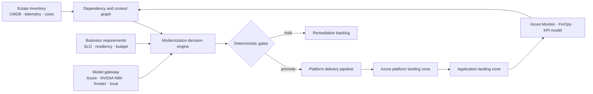

# Azure AI Cloud Modernization Platform Engineering

[](https://github.com/AAH20/azure-ai-cloud-modernization-platform-engineering/actions/workflows/ci.yml)

An evidence-driven reference implementation for **Azure Solutions Architecture**, **Azure Landing Zones**, **Cloud Migration**, **Application Modernization**, **Agentic AI**, **FinOps**, **DevSecOps**, **Infrastructure as Code**, and production-readiness evaluation.

This is not an autonomous production-deployment bot. It turns declared business and technical requirements into auditable recommendations, unit economics and deterministic release gates. AI components may recommend; only constrained workflows with explicit approvals may mutate production.

> **Current evidence boundary:** the decision engine and tests execute locally. Bicep and Terraform describe a minimal Azure foundation. No Azure deployment is claimed while subscription access is under support review.

## Why this exists

Enterprise modernization stalls when application, network, data, AI, security, operations and finance decisions are made independently. This project connects those decisions to a single workload record and answers four questions:

1. What should happen to this application?
2. What Azure foundation does it require?
3. Does the business case survive explicit unit economics?
4. Is the release allowed by deterministic readiness gates?

## Executable proof

```bash
PYTHONPATH=src python3 -m unittest discover -s tests -v
PYTHONPATH=src python3 -m modernization_factory.cli \
  examples/order-api.json \
  --output evidence/order-api-analysis.json
```

The synthetic case recommends `replatform`, calculates the three-year ROI and permits promotion only when all six release gates pass. Change an allowed region, rollback result or economic assumption and the decision becomes `hold`.

## Architecture



The target enterprise topology separates platform and application responsibilities:

```text
Tenant root
├── Platform management group
│   ├── Identity subscription
│   ├── Connectivity subscription
│   └── Management subscription
├── Landing zones management group
│   ├── Production application subscriptions
│   └── Non-production application subscriptions
├── Sandbox management group
└── Decommissioned management group
```

`management group` is written out in documentation; `mg` is used only where a short machine identifier is unavoidable.

## Repository map

| Path | Purpose |
|---|---|
| `src/modernization_factory` | Deterministic disposition, economics and gate engine |
| `examples` | Synthetic, non-customer workload inputs |
| `infra` | Subscription-scope Bicep foundation |
| `terraform` | Terraform/OpenTofu-compatible foundation alternative |
| `policy` | Machine-readable release authority boundary |
| `tests` | Positive and adverse decision cases |
| `evidence` | Generated results and evidence classification |
| `docs` | Architecture, economics and delivery guidance |

## What is implemented versus designed

| Capability | Status |
|---|---|
| Modernization disposition engine | Implemented and tested |
| Unit-economics calculation | Implemented and tested |
| Six deterministic release gates | Implemented and tested |
| Signed analysis digest | Implemented |
| Minimal subscription foundation in Bicep | Implemented; cloud deployment pending |
| Terraform/OpenTofu alternative | Implemented; cloud deployment pending |
| Model gateway and GraphRAG adapters | Architecture contract only |
| Fabric/Power BI semantic model | Roadmap |
| Multi-region production deployment | Roadmap; not claimed |

## Architecture decisions that demonstrate seniority

- A model cannot approve its own infrastructure changes.
- Financial benefit includes revenue enablement and operational capacity, not only cloud-cost reduction.
- High-cost Azure services are optional profiles, not always-on defaults.
- Hub-spoke, Virtual WAN and Azure Virtual Network Manager are explicit alternatives selected by scale and connectivity requirements.
- Every recommendation includes an evidence boundary and content digest.
- Production proof requires resource IDs, deployment output and operational assertions—not screenshots alone.

See [Architecture](docs/architecture.md), [Unit economics](docs/unit-economics.md), and [Delivery roadmap](docs/delivery-roadmap.md).

## Commercial use

The platform can support paid discovery, migration-factory implementation, Azure platform engineering and continuous optimization retainers. Pricing must follow measured estate complexity and value; the repository does not present synthetic ROI as a customer guarantee.

For architecture, implementation and managed-service engagements, visit [A2Z SOC](https://a2zsoc.com/).

## License and security

MIT. See [LICENSE](LICENSE) and [SECURITY.md](SECURITY.md).
